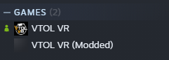

# VTOLVR Simple Mod Loader

A lightweight VTOL VR mod loader that registers itself as an external steam game. No more constantly reverifying files when switching between modded and unmodded VTOL VR.

### Features

-  Load on start as a primary feature
-  Separated steam install game
-  Lightweight, 2MB installer and 8MB after installation
-  ~~Automatic multiplayer mod sync~~ (WIP)
-  Live-refresh for mods, no need to restart the game when installing a new mod
-  Compatible with all existing VTOL VR mods

## Installation

Simply download the latest release from the [releases page](https://github.com/Strikeeaglechase/VTOLVR_SimpleModLoader/releases) and run the instal_RUN_ME.bat file. After installing you will need to restart steam, and then will see a "VTOL VR (Modded)" game in your library.

## Installing Mods

To install a mod simply put the zip or folder into the mods folder at `steamapps\common\VTOL VR Modded\SimpleModLoader\mods`. You can install mods while the game is running. If you would like a mod to be loaded automatically when the game starts, put it in the `load_on_start` folder.
Mods are downloaded from the [Normal VTOL VR Modding Website](https://vtolvr-mods.com/mods)

## Troubleshooting

If you are having an issue with a mod not working correctly, first check if it works correctly with the regular VTOL VR Mod loader, if the mod works there but not in the SML please report it [In the support server](https://discord.gg/yQ8ZW8cQRt).

If you are having an issue with the mod loader itself, try reinstalling it and restarting steam. If that doesn't work, please report it [In the support server](https://discord.gg/yQ8ZW8cQRt).

## Stuff to put in the Reference folder
- Assembly-CSharp
- UnityEngine
- UnityEngine.AssetBundleModule
- UnityEngine.CoreModule
- UnityEngine.CrashReportingModule
- UnityEngine.UI
- UnityEngine.UIElementsModule
- UnityEngine.UIModule
- VTBitConverter
- Facepunch.Steamworks.Win64.dll